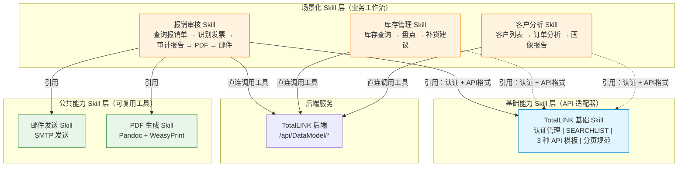

# TotalLINK Skill 设计文档

## 一、架构概述

### 1.1 当前架构

```
AI Agent ──直连HTTP──▶ TotalLINK 后端 (124.71.144.80:8088)
           ↑
           SKILL.md（指令文档，告诉 AI 如何调用 API）
```

MCP Server 层已废除，AI Agent 通过 Skill 文档直接构造 HTTP 请求调用 TotalLINK REST API。

### 1.2 改造历程

| 对比维度 | MCP Server（旧） | Skill（当前） |
|---------|-----------|-------|
| **部署** | Python 进程 + MCP 协议 | Markdown 文件 |
| **维护** | 改代码 → 重启服务 | 编辑文档即生效 |
| **延迟** | 多一跳代理转发 | 直连后端 |
| **认证** | `calc_value()` 动态令牌 | 静态令牌，`~/.totallink/config.json` 持久化 |
| **工具发现** | MCP `get_tools` → 匹配 | 硬编码 dmCode/dmNum（已知工具），SEARCHLIST 可选 |
| **调用方式** | `call_dynamic_tool(tool_id, ...)` | `POST /api/DataModel/...` 直接拼 payload |
| **可移植性** | 依赖 MCP 协议 | 平台无关 |

---

## 二、架构设计：三层模型



**核心原则：基础 Skill 提供"怎么调"，场景 Skill 定义"调什么 + 调完做什么"。**

---

## 三、各层职责划分

### 3.1 基础能力 Skill —— `totallink-base`

**定位**：全局唯一的 API 适配器，所有场景 Skill 的"头文件"。

| 职责模块 | 内容 |
|---------|------|
| 认证管理 | 首次用户提供 → 持久化 `~/.totallink/config.json` → 后续自动读取至 `${TOTALLINK_AUTH_TOKEN}` |
| 工具发现 | SEARCHLIST-100 接口格式（**可选**，已知工具硬编码 dmCode/dmNum 时跳过） |
| AIResult（查询） | Payload 模板、`Para` 数组约定、分页规则（默认 20 条/页） |
| AIRowSubmit（行提交） | Payload 模板（含 `scriptType`、`rowData`） |
| AIDataSubmit（批量提交） | Payload 模板（含 `scriptType`、`rowData`、`tableData`） |
| 响应约定 | `isSuccess`/`data`/`message` 格式、`Table` schema+data 格式 |
| 错误处理 | Token 失效、HTTP 错误码 |

### 3.2 公共能力 Skill

| Skill | 职责 | 被引用场景 |
|-------|------|-----------|
| `email-sender` | SMTP 邮件发送（163 SSL 465） | 报销审核、任何需要发送报告的场景 |
| `pdf-generator` | Pandoc + WeasyPrint Markdown→PDF | 报销审核、任何需要生成报告的场景 |

### 3.3 场景化 Skill —— `reimbursement-audit`

**定位**：自治的业务工作流，引用基础 Skill 和公共 Skill。

| 职责模块 | 内容 |
|---------|------|
| 业务上下文 | 解决什么问题、默认时间范围 |
| 工具清单 | 硬编码 dmCode/dmNum（4 个报销工具），无需 SEARCHLIST 发现 |
| 工作流步骤 | 6 步：查询→详情→发票识别→核对→报告→PDF+邮件 |
| 业务逻辑 | 核对规则（金额一致性、发票时效、费用归类……） |
| 输出格式 | 审计报告的 Markdown 结构 |

---

## 四、关键技术决策

### 决策 1：认证令牌管理

| 旧方案（MCP） | 当前方案（Skill） |
|-------------|-------------|
| 客户端 `calc_value()` 动态计算 | 静态令牌，`~/.totallink/config.json` 持久化 |
| `loginID = "userid " + 动态值` | `loginID = "${TOTALLINK_AUTH_TOKEN}"` |
| 15 行 Python 代码 | 用户提供一次，后续自动读取 |
| 令牌依赖时间同步 | 长期有效 |

**令牌读取优先级**：`auth_token` 参数 → 环境变量 `TOTALLINK_AUTH_TOKEN` → `~/.totallink/config.json`

### 决策 2：工具发现方式

选择**硬编码优先**，SEARCHLIST 作为可选补充。

| | 运行时发现（旧） | 硬编码（当前） |
|---|---|---|
| 优点 | 工具变更时自动感知 | 零额外 API 调用，AI 直接可用 |
| 缺点 | 每次会话多一次请求 | 后端工具变动需同步更新 Skill |
| 选择 | — | ✅ 选用。已知工具直接硬编码 dmCode/dmNum |

场景化 Skill 的工具表中直接写明 dmCode/dmNum，AI Agent 无需任何查询步骤即可调用。

### 决策 3：Skill 间引用方式

采用**文档层面的知识引用**，非代码依赖：

```
场景 Skill 开头声明：
  - TotalLINK 认证：参照基础 Skill 完成配置
  - API 调用：遵循基础 Skill 的 Payload 格式和分页约定
  - 邮件发送：参照 邮件发送 Skill
  - PDF 生成：参照 PDF 生成 Skill
```

AI Agent 同时加载多个 Skill 时，将基础 Skill 的 API 模板套用在场景 Skill 的步骤中。

### 决策 4：分页逻辑

从 MCP 的 `paginate_data()` Python 函数，简化为 Skill 文档中的规则：

> - 默认每页 20 条数据
> - 响应中 `pagination.total_pages` 判断是否还有后续
> - 用户未明确要求翻页时不自动翻页

AI Agent 按此规则自行决定何时翻页。

---

## 五、文件目录结构

```
skills/
├── DESIGN.md                        # 本设计文档
├── totallink-base/
│   └── SKILL.md                     # 基础 Skill
├── reimbursement-audit/
│   └── SKILL.md                     # 报销审核场景 Skill
└── shared/
    ├── email-sender/
    │   └── SKILL.md                 # 公共：邮件发送
    └── pdf-generator/
        └── SKILL.md                 # 公共：PDF 生成
```

未来可扩展的场景：

```
skills/
├── inventory-management/           # 库存管理
├── customer-analysis/              # 客户分析
├── project-tracking/               # 项目跟踪
└── ...
```

---

## 六、API 映射对照表

### 6.1 工具发现

| 方式 | 调用 |
|------|------|
| 硬编码（推荐） | 无需调用，Skill 文档中直接给出 dmCode/dmNum |
| SEARCHLIST（可选） | `POST /api/DataModel/linkDMAIResult`<br>`{ dmCode: "SEARCHLIST", dmNum: 100, Para: [] }` |

### 6.2 数据查询

```
POST ${TOTALLINK_BASE_URL}/api/DataModel/linkDMAIResult
{
  "loginID": "${TOTALLINK_AUTH_TOKEN}",
  "par": { "dmCode": "LINKEXP01", "dmNum": 9, "Para": ["", "2026-06-20", "2026-07-10", ""] }
}
```

响应含 `pagination`，AI 按需翻页（不自动翻页）。

### 6.3 行数据提交

```
POST ${TOTALLINK_BASE_URL}/api/DataModel/linkDMAIRowSubmit
{
  "loginID": "${TOTALLINK_AUTH_TOKEN}",
  "par": {
    "dm": { "dmCode": "LINKEXP0110X", "dmNum": 503, "Para": ["EXP260600009"] },
    "scriptType": 4,
    "rowData": { "DOCNUM": "EXP260600009", "REMARK": "驳回原因" }
  }
}
```

### 6.4 批量数据提交

```
POST ${TOTALLINK_BASE_URL}/api/DataModel/linkDMAIDataSubmit
{
  "loginID": "${TOTALLINK_AUTH_TOKEN}",
  "par": {
    "dm": { "dmCode": "<dmCode>", "dmNum": <dmNum>, "Para": [...] },
    "scriptType": <操作类型>,
    "rowData": { ... },
    "tableData": [{ ... }, { ... }]
  }
}
```

---

## 七、实施状态

| 阶段 | 状态 |
|------|:--:|
| 后端令牌模式（loginID 接受纯 token） | ✅ |
| 基础 Skill 编写 | ✅ |
| 报销审核 Skill 编写（含硬编码 dmCode/dmNum） | ✅ |
| 公共 Skill（email-sender / pdf-generator） | ✅ |
| MCP Server 废除 | ✅ |
| 端到端测试 | 待验证 |

---

## 八、风险与注意事项

1. **Token 持久化**：`~/.totallink/config.json` 持久化存储。AI Agent 启动时从文件读取并注入环境变量 `${TOTALLINK_AUTH_TOKEN}`。重启后如丢失，提示用户重新提供。
2. **Para 数组类型**：AI Agent 需确保传字符串数组 `["", "参数1"]`，空位 `""` 而非 `null`。
3. **分页感知**：AI Agent 需理解 `pagination.total_pages`，不自动无限翻页。
4. **dmCode/dmNum 同步**：后端工具 dmCode/dmNum 变更时，需同步更新场景 Skill 中的硬编码值。
5. **错误处理**：`isSuccess: "false"` 检查 `message`；`HTTP 401/403` 提示更新令牌；`HTTP 5xx` 提示稍后重试。

## 九、参考

- [TotalLINK 基础 Skill](./totallink-base/SKILL.md) — 认证、API、工具发现
- [报销审核 Skill](./reimbursement-audit/SKILL.md) — 场景化工作流示例
- [邮件发送 Skill](./shared/email-sender/SKILL.md) — 公共能力
- [PDF 生成 Skill](./shared/pdf-generator/SKILL.md) — 公共能力
