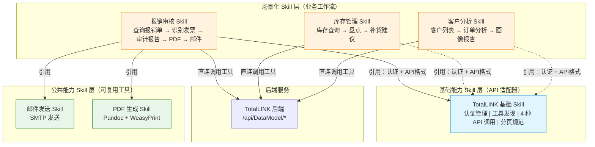

# TotalLINK MCP → Skill 改造设计方案

## 一、背景与动机

### 1.1 现状

当前 TotalLINK 数据平台通过 MCP Server 对外暴露能力：

```
AI Agent ──MCP协议──▶ MCP Server (Python, :7077) ──HTTP──▶ TotalLINK 后端 (124.71.144.80:8088)
                        ├── 认证（calc_value 动态令牌）
                        ├── 工具发现（SEARCHLIST-100）
                        ├── 分页逻辑（paginate_data）
                        ├── 工具匹配（match_tool_by_query）
                        ├── 4 种工具路由（AIResult/AIAction/AIRowSubmit/AIDataSubmit）
                        └── 15 分钟内存缓存
```

这个架构的核心问题是：MCP Server 本质上只是 **HTTP → MCP 协议适配层**，所有业务逻辑都在 TotalLINK 后端。MCP Server 需要部署、维护 Python 进程，增加了一层转发延迟。

### 1.2 目标

将 MCP Server 改造为 **Skill 模式**——用 Markdown 指令文档替代中间代理服务器，让 AI Agent 直连后端 API。

```
AI Agent ──直连HTTP──▶ TotalLINK 后端 (124.71.144.80:8088)
           ↑
           SKILL.md（指令文档，告诉 AI 如何调用 API）
```

### 1.3 改造收益

| 对比维度 | MCP Server | Skill |
|---------|-----------|-------|
| **部署** | 需要 Python 环境 + 常驻进程 | 只有 Markdown 文件 |
| **维护** | 需更新代码、重启服务 | 编辑文档即可生效 |
| **延迟** | 多一跳代理转发 | 直连后端 |
| **工具匹配** | 关键字规则匹配 | AI 语义理解（更强） |
| **可移植性** | 依赖 MCP 协议 | 平台无关（任何支持 Skill 的 AI 平台） |
| **代码量** | utils.py 587 行 | 基础 Skill ~160 行 Markdown |

---

## 二、架构设计：三层模型



**核心原则：基础 Skill 提供"怎么调"，场景 Skill 定义"调什么 + 调完做什么"。**

---

## 三、各层职责划分

### 3.1 基础能力 Skill —— `totallink-base`

**定位**：全局唯一的 API 适配器，所有场景 Skill 的"头文件"。

| 职责模块 | 内容 |
|---------|------|
| 认证管理 | `TOTALLINK_AUTH_TOKEN` 配置、持久化策略、失效恢复 |
| 工具发现 | 调用 `SEARCHLIST-100` 的 payload 格式、返回数据解析规则 |
| AIResult（查询） | Payload 模板、`Para` 数组约定、分页规则（默认 20 条/页） |
| AIAction（操作） | Payload 模板（含 `contextMenuNo`、`rowData`） |
| AIRowSubmit（行提交） | Payload 模板（含 `scriptType`、`rowData`） |
| AIDataSubmit（批量提交） | Payload 模板（含 `scriptType`、`rowData`、`tableData`） |
| 响应约定 | `isSuccess`/`data`/`message` 格式、`Table` 新旧格式兼容 |
| 错误处理 | Token 失效、HTTP 错误码、限流 |

### 3.2 公共能力 Skill

| Skill | 职责 | 被引用场景 |
|-------|------|-----------|
| `email-sender` | SMTP 邮件发送（163 SSL 465） | 报销审核、任何需要发送报告的场景 |
| `pdf-generator` | Pandoc + WeasyPrint Markdown→PDF | 报销审核、任何需要生成报告的场景 |

### 3.3 场景化 Skill —— `reimbursement-audit`

**定位**：自治的业务工作流，引用基础 Skill 和公共 Skill。

| 职责模块 | 内容 |
|---------|------|
| 业务上下文 | 解决什么问题、默认时间范围 |
| 工具清单 | 本场景需要的工具名称（从 SEARCHLIST 结果按名匹配） |
| 工作流步骤 | 7 步：查询→附件→发票识别→核对→报告→PDF→邮件 |
| 业务逻辑 | 核对规则（金额一致性、发票时效、费用归类……） |
| 输出格式 | 审计报告的 Markdown 结构 |

---

## 四、关键技术决策

### 决策 1：认证令牌简化

| 改造前（MCP） | 改造后（Skill） |
|-------------|-------------|
| 客户端 `calc_value()` 实时计算动态令牌 | 用户在 TotalLINK 系统中申请静态令牌 |
| `loginID = "userid " + 动态令牌` | `loginID = "${TOTALLINK_AUTH_TOKEN}"` |
| 15 行 Python 代码 | 一行环境变量 |
| 令牌依赖时间，需同步 | 长期有效，手动申请 |

**服务端配合改造**：`loginID` 接受纯静态 token，不再要求 `userid + 动态值` 的组合格式。

### 决策 2：工具发现方式

选择**运行时发现**（每次会话首次调用 SEARCHLIST-100），而非硬编码 dmCode/dmNum。

| | 运行时发现 | 硬编码 |
|---|---|---|
| 优点 | 工具变更时 Skill 无需修改 | 少一次 API 调用 |
| 缺点 | 多一次请求 | 后端工具变动需同步更新所有 Skill |
| 建议 | ✅ 选用 | 仅工具极其稳定时考虑 |

### 决策 3：Skill 间引用方式

采用**文档层面的知识引用**，而非代码依赖：

```
场景 Skill 开头声明：
  - TotalLINK 认证：参照 TotalLINK 基础 Skill 完成配置
  - API 调用规范：遵循基础 Skill 的 Payload 格式和响应约定
  - 工具发现：通过基础 Skill 的 SEARCHLIST-100 接口获取
  - 邮件发送：参照 邮件发送 Skill
  - PDF 生成：参照 PDF 生成 Skill
```

AI Agent 同时加载多个 Skill 时，会将基础 Skill 的规范套用在场景 Skill 的步骤中。不需要运行时 import，完全解耦。

### 决策 4：分页逻辑

从 MCP 的 `paginate_data()` Python 函数（90 行），简化为 Skill 文档中的规则描述：

> - 默认每页 20 条数据
> - 响应中 `pagination.total_pages` 判断是否还有后续
> - 用户未明确要求翻页时不自动翻页

AI Agent 按此规则自行决定何时翻页，比硬编码更灵活。

### 决策 5：工具匹配

从 MCP 的 `match_tool_by_query()` 关键字匹配（35 行），改为：

1. 调用 SEARCHLIST-100 获取完整工具列表
2. AI Agent 根据 `TOOL_NAME` 和 `TOOL_DESC` 做语义理解
3. 自行匹配最合适的工具

AI 的语义理解能力远超关键字匹配，且零代码维护。

---

## 五、文件目录结构

```
skills/
├── DESIGN.md                        # 本设计文档
├── totallink-base/
│   └── SKILL.md                     # 基础 Skill
├── reimbursement-audit/
│   └── SKILL.md                     # 报销审核场景 Skill
└── shared/
    ├── email-sender/
    │   └── SKILL.md                 # 公共：邮件发送
    └── pdf-generator/
        └── SKILL.md                 # 公共：PDF 生成
```

未来可扩展的场景 Skill：

```
skills/
├── inventory-management/
│   └── SKILL.md                     # 库存管理：库存查询 → 盘点 → 补货建议
├── customer-analysis/
│   └── SKILL.md                     # 客户分析：客户列表 → 订单分析 → 画像报告
├── project-tracking/
│   └── SKILL.md                     # 项目跟踪：项目列表 → 进度查询 → 周报生成
└── ...
```

---

## 六、API 映射对照表

### 6.1 工具发现

| 原 MCP 调用 | 新 Skill 调用 |
|-----------|-------------|
| `mcp__TotalLINK__get_tools(userid)` | `POST /api/DataModel/linkDMAIResult`<br>`{ dmCode: "SEARCHLIST", dmNum: 100, Para: [] }` |
| 返回 `{ total, tools: [{ tool_id, name, description, toolType }] }` | 返回 `data.Table` 含 `TOOL_ID/TOOL_CODE/TOOL_NUM/TOOL_NAME/TOOL_DESC/TOOL_TYPE` |

### 6.2 数据查询

| 原 MCP 调用 | 新 Skill 调用 |
|-----------|-------------|
| `mcp__TotalLINK__call_dynamic_tool(tool_id, parameters, userid, page)` | `POST /api/DataModel/linkDMAIResult` |
| `loginID = "randy.liu " + calc_value()` | `loginID = "${TOTALLINK_AUTH_TOKEN}"` |
| Python `paginate_data()` 分页 | 响应中直接含 `pagination`，AI 按需翻页 |

### 6.3 数据操作（Action）

| 原 MCP 调用 | 新 Skill 调用 |
|-----------|-------------|
| `call_dynamic_tool` → 路由到 `ai_action()` | `POST /api/DataModel/linkDMAIAction` |
| `par.dm.Para` + `contextMenuNo` + `rowData` | 相同 payload 结构 |

### 6.4 行数据提交

| 原 MCP 调用 | 新 Skill 调用 |
|-----------|-------------|
| `call_dynamic_tool` → 路由到 `ai_row_submit()` | `POST /api/DataModel/linkDMAIRowSubmit` |
| `par.dm.Para` + `scriptType` + `rowData` | 相同 payload 结构 |

### 6.5 批量数据提交

| 原 MCP 调用 | 新 Skill 调用 |
|-----------|-------------|
| `call_dynamic_tool` → 路由到 `ai_data_submit()` | `POST /api/DataModel/linkDMAIDataSubmit` |
| `par.dm.Para` + `scriptType` + `rowData` + `tableData` | 相同 payload 结构 |

---

## 七、实施路径

### Phase 1：服务端改造

- [ ] 新增用户令牌管理功能（TotalLINK 系统设置页 → AI 令牌管理）
- [ ] `loginID` 支持纯静态 token 验证（不再要求 `userid + 动态值` 格式）
- [ ] 令牌持久化存储，支持用户查看/重置

### Phase 2：基础 Skill 验证

- [x] 编写 `totallink-base/SKILL.md`
- [ ] 在 AI Agent 中手动执行 SEARCHLIST-100 调用，验证工具发现流程
- [ ] 验证 4 种 API 调用的 payload 格式正确性

### Phase 3：报销审核 Skill 迁移

- [x] 编写 `reimbursement-audit/SKILL.md`
- [x] 抽取公共 Skill（`email-sender`、`pdf-generator`）
- [ ] 端到端测试：查报销单 → 发票识别 → 报告 → PDF → 邮件
- [ ] 对比 MCP 版本结果，确保正确性

### Phase 4：旧架构下线

- [ ] 新 Skill 稳定运行一个周期后，停止 MCP Server 进程
- [ ] 保留 `main.py`/`utils.py` 作为参考文档归档

---

## 八、风险与注意事项

1. **Token 持久化**：Skill 平台重启后环境变量可能丢失。参考 `SKILL.md` 的三种配置方式（平台配置注入 / 全局环境变量 / 本地文件备份），推荐使用平台配置注入。
2. **Para 数组类型**：AI Agent 可能传入错误的参数类型（如传对象而非数组）。Skill 文档中明确强调 `["", "参数1", "参数2"]` 格式。
3. **分页感知**：AI Agent 需要理解 `pagination.total_pages` 的含义，不自动无限翻页。Skill 文档中已明确"用户未要求时不自动翻页"。
4. **错误处理**：从 Python try/except 变为 AI 读取 HTTP 响应。需要在 Skill 文档中明确错误码含义和恢复策略。
5. **向后兼容**：改造期间 MCP Server 和 Skill 可并行运行，逐步切换，零风险。

---

## 九、参考

- [TotalLINK 基础 Skill](./totallink-base/SKILL.md) — 认证、API、工具发现
- [报销审核 Skill](./reimbursement-audit/SKILL.md) — 场景化工作流示例
- [邮件发送 Skill](./shared/email-sender/SKILL.md) — 公共能力
- [PDF 生成 Skill](./shared/pdf-generator/SKILL.md) — 公共能力
- [参考 Skill 模板](../reference/SKILL.md) — 思必驰 Skill 格式参考
- [原 MCP 主入口](../main.py) — 历史参考
- [原 MCP 工具函数](../utils.py) — 历史参考
